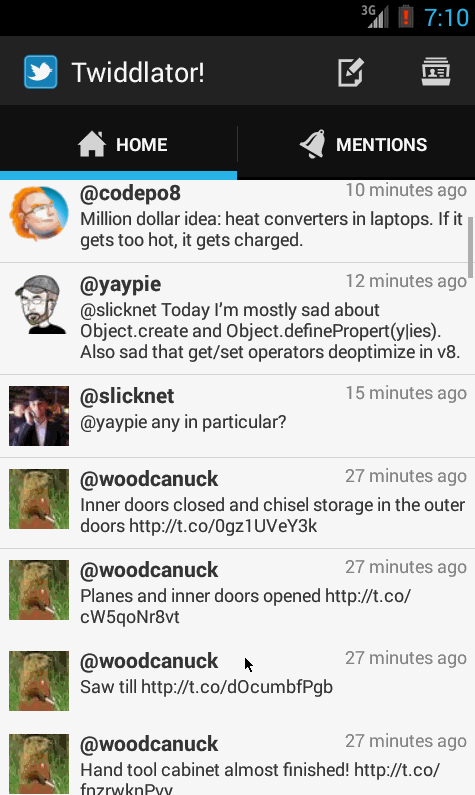
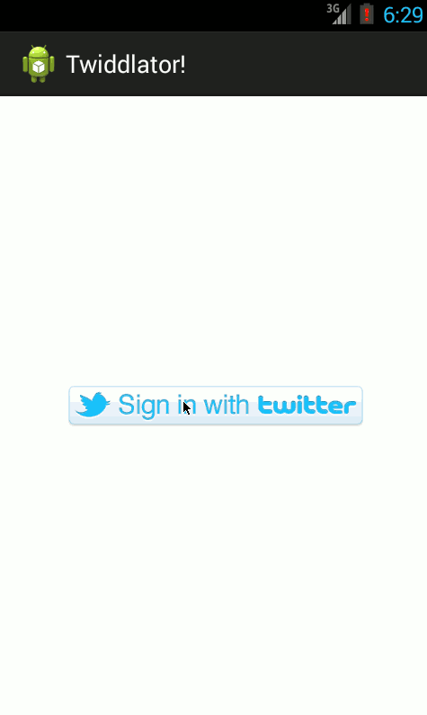

Simple Twitter Client
=====================

Overview
--------

Build a simple Twitter client that supports viewing a Twitter timeline and composing a new tweet.

User Stories
------------

The following user stories must be completed:

* User can sign in to Twitter using OAuth login
* User can view the tweets from their home timeline
  * User should be able to see the username, name, body and timestamp for each tweet
  * User should be displayed the relative timestamp for a tweet "8m", "7h"
  * User can view more tweets as they scroll with infinite pagination
  * Optional: Links in tweets are clickable and will launch the web browser (see autolink)
* User can compose a new tweet
  * User can click a “Compose” icon in the Action Bar on the top right
  * User can then enter a new tweet and post this to twitter
  * User is taken back to home timeline with new tweet visible in timeline
  * Optional: User can see a counter with total number of characters left for tweet
* User can switch between Timeline and Mention views using tabs.
  * User can view their home timeline tweets.
  * User can view the recent mentions of their username.
  * User can scroll to bottom of either of these lists and new tweets will load ("infinite scroll")
  * Optional: Implement tabs in a gingerbread-compatible approach
* User can navigate to view their own profile
  * User can see picture, tagline, # of followers, # of following, and tweets on their profile.
* User can click on the profile image in any tweet to see another user's profile.
  * User can see picture, tagline, # of followers, # of following, and tweets of clicked user.
  * Profile view should include that user's timeline
  * Optional: User can view following / followers list through the profile

The following advanced user stories are optional:

* Advanced: User can refresh tweets timeline by pulling down to refresh (i.e pull-to-refresh)
* Advanced: User can open the twitter app offline and see last loaded tweets
  * Tweets are persisted into sqlite and can be displayed from the local DB
* Advanced: User can tap a tweet to display a "detailed" view of that tweet
* Advanced: User can select "reply" from detail view to respond to a tweet
* Advanced: Improve the user interface and theme the app to feel "twitter branded"
* Bonus: User can see embedded image media within the tweet detail view
* Bonus: Compose activity is replaced with a modal overlay
* Advanced: Robust error handling, check if internet is available, handle error cases, network failures
* Advanced: When a network request is sent, user sees an indeterminate progress indicator
* Advanced: User can "reply" to any tweet on their home timeline
  * The user that wrote the original tweet is automatically "@" replied in compose
* Advanced: User can click on a tweet to be taken to a "detail view" of that tweet
  * Advanced: User can take favorite (and unfavorite) or reweet actions on a tweet
* Advanced: Improve the user interface and theme the app to feel twitter branded
* Advanced: User can search for tweets matching a particular query and see results
* Bonus: User can view their direct messages (or send new ones)

Second Screen Capture (Week 4 assignment)
-----------------------------------------

First Screen Capture (Week 3 assignment)
----------------------------------------

